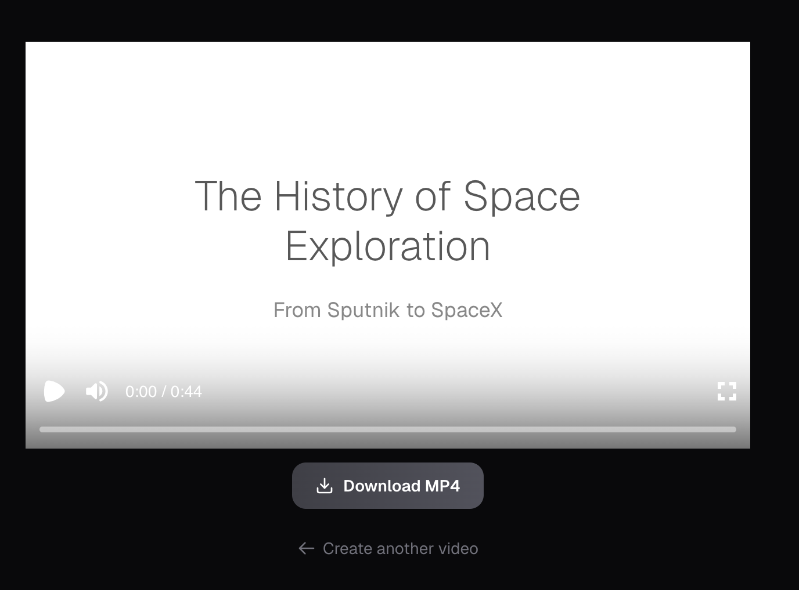
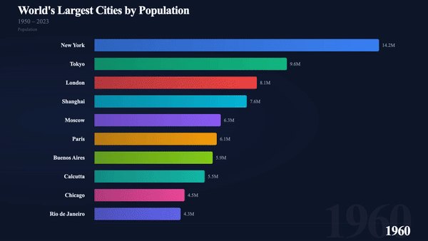
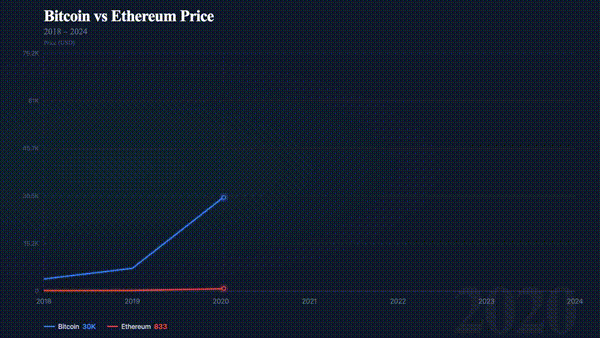

<div align="center">

# Prompt to Video

**Turn any text prompt into a polished, downloadable video in seconds.**

[](LICENSE)
[](https://nextjs.org/)
[](https://www.typescriptlang.org/)
[](https://www.remotion.dev/)
[](https://tailwindcss.com/)

Describe an idea → pick a style → get a 1080p MP4. No video editing skills required.

</div>

---

## What it makes

### Presentation Videos
Cinematic or corporate slide-style videos — split-screen layouts, Unsplash imagery, animated text, smooth transitions.



### Bar Chart Race
Animated ranking charts where bars grow and reorder as values change across time periods.



### Line Charts
Multi-series trend visualizations drawn frame-by-frame with smooth progressive animation.



---

## Quick start

```bash
git clone https://github.com/your-username/prompt-to-video.git
cd prompt-to-video
npm install
```

Create `.env.local`:

```env
OPENROUTER_API_KEY=your_key_here    # openrouter.ai/keys
UNSPLASH_ACCESS_KEY=your_key_here   # unsplash.com/oauth/applications
```

```bash
npm run dev
```

Open [http://localhost:3000](http://localhost:3000) and start generating.

> Both API keys have free tiers. A single OpenRouter key covers all AI models used.

---

## How it works

```
Your prompt
    │
    ▼
/api/generate
    ├── Presentation  →  Llama 4 Scout  →  JSON scene graph
    │       └── Unsplash API  →  auto stock imagery per scene
    │
    ├── Bar Chart     →  Gemini 2.0 Flash  →  JSON time-series frames
    │
    └── Line Chart    →  Gemini 2.0 Flash  →  JSON series data
    │
    ▼
Remotion <Player>  →  live in-browser preview
    │
    ▼
/api/render  →  server-side MP4 render  →  browser download
```

AI writes the script and data. Remotion handles the animation and rendering. You just write a sentence.

---

## Example prompts

**Presentations**
```
The history of space exploration from Sputnik to SpaceX
How the internet changed society over 30 years
The story of the iPhone from 2007 to today
```

**Bar chart race**
```
Top 10 most subscribed YouTube channels 2005–2024
Most valuable companies by market cap 2000–2024
Top programming languages by popularity 2010–2024
```

**Line chart**
```
Revenue growth of Apple, Google, and Microsoft 2010–2024
Global CO2 emissions by country 2000–2023
Bitcoin vs Ethereum price 2018–2024
```

---

## Features

- **3 video types** — Presentation, Bar Chart Race, Line Chart
- **2 presentation styles** — Storytelling (cinematic) and Corporate (professional)
- **AI-generated scripts and data** — Llama 4 Scout for presentations, Gemini 2.0 Flash for charts
- **Auto stock imagery** — Unsplash photo per scene, chosen from the prompt context
- **In-browser preview** — Watch before downloading using the embedded Remotion player
- **1080p MP4 export** — Full-resolution 1920×1080 download, rendered server-side
- **Dark mode** — Respects system preference
- **Keyboard shortcut** — `⌘ Enter` / `Ctrl+Enter` to submit

---

## Tech stack

| Layer | Technology |
|---|---|
| Framework | Next.js 15 (App Router) |
| UI | React 19, Tailwind CSS 4, Geist font |
| Video rendering | Remotion 4 |
| AI — presentations | OpenRouter → `meta-llama/llama-4-scout` |
| AI — charts | OpenRouter → `google/gemini-2.0-flash-001` |
| Images | Unsplash API |
| Language | TypeScript 5 |

---

## Project structure

```
src/
├── app/
│   ├── page.tsx               # Multi-step UI (prompt → templates → generating → video)
│   ├── layout.tsx             # Root layout, metadata, fonts
│   ├── globals.css            # Tailwind base + transitions
│   └── api/
│       ├── generate/route.ts  # AI generation endpoint
│       └── render/route.ts    # Remotion server-side MP4 rendering
├── components/
│   ├── Input.tsx              # Prompt textarea, type tabs, Cmd+Enter
│   ├── TemplateSelector.tsx   # Presentation template grid
│   ├── TemplateCard.tsx       # Template card with preview thumbnail
│   ├── VideoPlayer.tsx        # Remotion Player wrapper + download
│   └── remotion/
│       ├── PromoVideo.tsx     # Presentation scene renderer
│       ├── ChartVideo.tsx     # Bar chart race renderer
│       └── LineChartVideo.tsx # Line chart renderer
└── lib/
    └── templates.ts           # Template definitions
```

---

## Contributing

PRs and issues are welcome. If you add a new video type, AI model, or export option — open a PR.

---

## License

MIT
