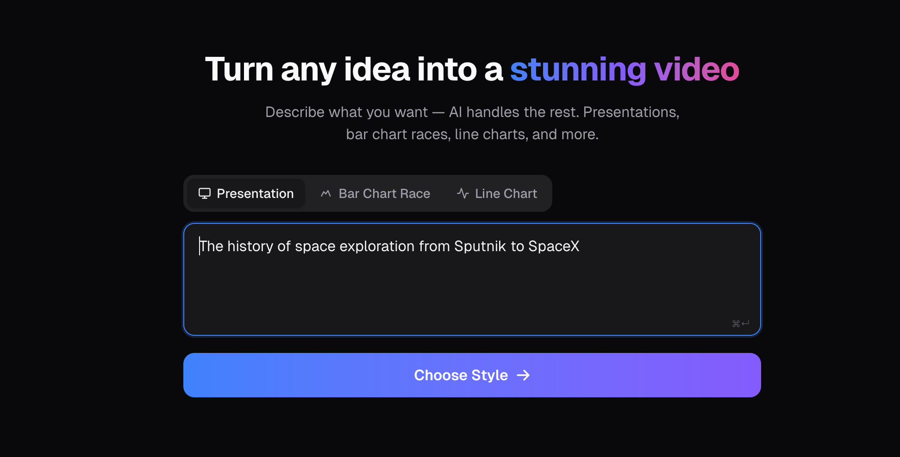
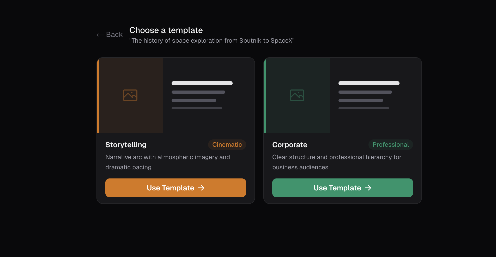
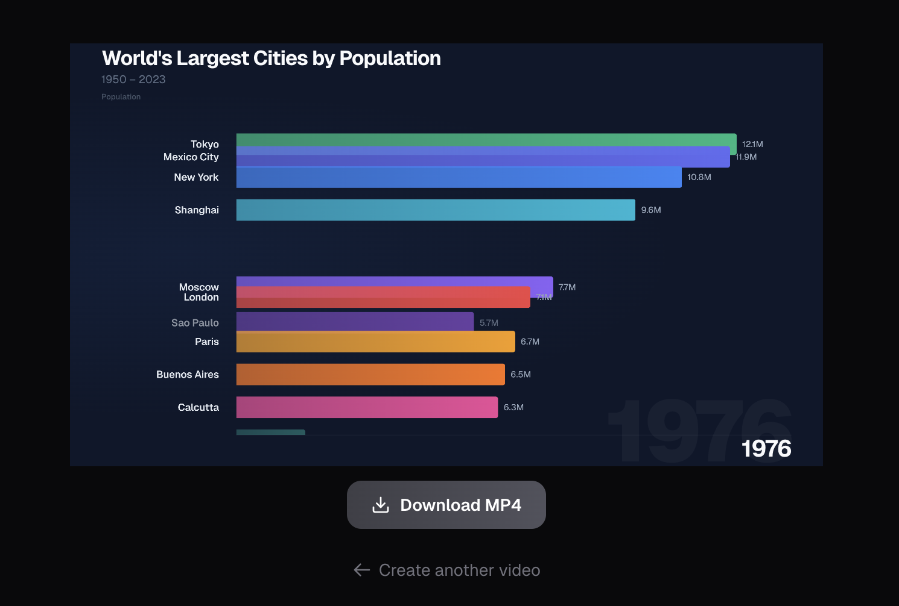
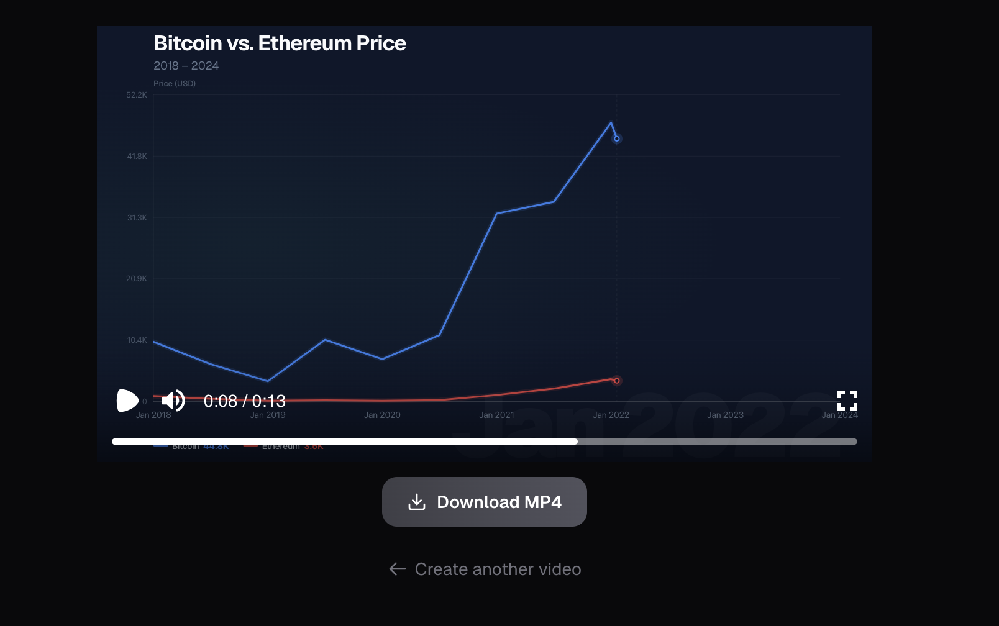

# Prompt to Video — AI Video Generator

> Turn any text prompt into a polished, downloadable video in seconds.

Prompt to Video is an AI-powered video creation tool built with Next.js and Remotion. Describe an idea, pick a video style, and the app generates a fully animated video complete with stock imagery, charts, and smooth transitions — no video editing skills required.

---

## Demo

> Replace the placeholders below with your actual screenshots or screen recordings.

### Prompt Input


### Template Selection


### Generated Presentation Video


### Bar Chart Race
World's largest cities by population 1950–2023


### Line Chart
Bitcoin vs Ethereum price 2018–2024


> **Tip:** Use [ScreenToGif](https://www.screentogif.com/) (Windows) or [Kap](https://getkap.co/) (macOS) to record a GIF of the app in action and drop it here.

---

## Features

- **Presentation videos** — Cinematic or corporate slide-style videos with split-screen layouts, Unsplash imagery, and narration text
- **Bar chart race** — Animated ranking charts that show how values shift across time periods
- **Line charts** — Multi-series trend visualizations drawn frame-by-frame with smooth animations
- **AI-generated scripts** — Llama 4 Scout writes scene-by-scene video structure; Gemini 2.0 Flash generates chart data
- **Auto stock imagery** — Every presentation scene fetches a relevant photo from Unsplash automatically
- **In-browser preview** — Watch the video live before downloading using the Remotion player
- **MP4 export** — Download any video as a full-resolution 1920×1080 MP4
- **Dark mode** — Fully supports system dark/light preference
- **Keyboard shortcut** — Submit with `⌘ Enter` / `Ctrl+Enter`

---

## Video Types

### Presentation

Generates a 15–19 scene narrative video using split-screen layouts with imagery on one side and text on the other. Two style options:

| Style | Mood | Best for |
|---|---|---|
| **Storytelling** | Cinematic | Documentary feel, evocative prose, atmospheric imagery |
| **Corporate** | Professional | Business pitches, structured bullet points, clean transitions |

**Example prompts:**
```
The history of space exploration from Sputnik to SpaceX
How the internet changed society over 30 years
The story of the iPhone from 2007 to today
```

---

### Bar Chart Race

Generates an animated ranking bar chart where bars grow and reorder as values change across time periods. Always renders 10 bars at a time.

**Example prompts:**
```
Top 10 most subscribed YouTube channels 2005–2024
Most valuable companies by market cap 2000–2024
World's largest cities by population 1950–2023
Top programming languages by popularity 2010–2024
```

**Output format:**
- Up to 10 ranked bars per frame
- Each time period animates over 60 frames (~2 seconds)
- Values auto-formatted as millions, billions, or percentages

---

### Line Chart

Generates an animated multi-series line chart where lines are drawn progressively across time. Supports 2–8 data series.

**Example prompts:**
```
Revenue growth of Apple, Google, and Microsoft 2010–2024
Global CO2 emissions by country 2000–2023
Monthly active users of Facebook, Instagram, and TikTok 2015–2024
Bitcoin vs Ethereum price 2018–2024
```

**Output format:**
- 2–8 colored series with distinct colors
- 10–25 data points per series drawn progressively
- Each data point animates over 30 frames (~1 second)

---

## Tech Stack

| Layer | Technology |
|---|---|
| Framework | [Next.js](https://nextjs.org/) 15 (App Router) |
| UI | React 19, Tailwind CSS 4, Geist font |
| Video rendering | [Remotion](https://www.remotion.dev/) 4 |
| AI — presentations | [OpenRouter](https://openrouter.ai/) → `meta-llama/llama-4-scout` |
| AI — charts | [OpenRouter](https://openrouter.ai/) → `google/gemini-2.0-flash-001` |
| Images | [Unsplash API](https://unsplash.com/developers) |
| Language | TypeScript 5 |

---

## Getting Started

### Prerequisites

- Node.js 18+
- An [OpenRouter](https://openrouter.ai/) API key (covers both AI models)
- An [Unsplash](https://unsplash.com/developers) access key (free tier works fine)

### Installation

```bash
git clone https://github.com/your-username/prompt-to-video.git
cd prompt-to-video
npm install
```

### Environment Variables

Create a `.env.local` file in the project root:

```env
OPENROUTER_API_KEY=your_openrouter_api_key_here
UNSPLASH_ACCESS_KEY=your_unsplash_access_key_here
```

| Variable | Where to get it |
|---|---|
| `OPENROUTER_API_KEY` | [openrouter.ai/keys](https://openrouter.ai/keys) |
| `UNSPLASH_ACCESS_KEY` | [unsplash.com/oauth/applications](https://unsplash.com/oauth/applications) |

### Run the dev server

```bash
npm run dev
```

Open [http://localhost:3000](http://localhost:3000) in your browser.

---

## Usage

1. **Enter a prompt** — Describe what you want to visualize in the text field
2. **Choose a video type** — Select Presentation, Bar Chart Race, or Line Chart using the tab buttons
3. **Pick a style** *(presentations only)* — Storytelling (cinematic) or Corporate (professional)
4. **Wait for generation** — AI scripts the video and fetches imagery; usually 15–40 seconds
5. **Preview** — Watch the result in the built-in Remotion player
6. **Download** — Click "Download MP4" to render and save a 1920×1080 MP4 file

> Press `⌘ Enter` (Mac) or `Ctrl+Enter` (Windows/Linux) to submit your prompt without reaching for the mouse.

---

## How It Works

```
User prompt
    │
    ▼
/api/generate
    │
    ├── Presentation → Llama 4 Scout → JSON scene graph
    │       └── Unsplash API → resolves image search queries → real photo URLs
    │
    ├── Bar Chart Race → Gemini 2.0 Flash → JSON time-series frames
    │       └── Unsplash API → cover image
    │
    └── Line Chart → Gemini 2.0 Flash → JSON series data
            └── Unsplash API → cover image
    │
    ▼
Remotion <Player> — live browser preview
    │
    ▼
/api/render (on download)
    └── Remotion server-side render → MP4 blob → browser download
```

### Scene graph structure (presentations)

Each scene in a presentation has a **layout** (`title`, `split-left`, `split-right`, `text-only`) and a list of **elements** (background, image, text). The `PromoVideo` Remotion component reads this JSON and animates each element into frame using fade, slide, or scale transitions.

### Chart data structure

Bar chart frames and line chart series are plain JSON arrays that the `ChartVideo` and `LineChartVideo` Remotion components read to drive progressive animation — each data point or ranking period plays out over a fixed number of frames.

---

## Project Structure

```
src/
├── app/
│   ├── page.tsx               # Multi-step UI (prompt → templates → generating → video)
│   ├── layout.tsx             # Root layout, metadata, fonts
│   ├── globals.css            # Tailwind base + smooth transitions
│   └── api/
│       ├── generate/route.ts  # AI generation endpoint (presentations + charts)
│       └── render/route.ts    # Remotion server-side MP4 rendering endpoint
├── components/
│   ├── Input.tsx              # Prompt textarea, type tabs (icons + Cmd+Enter)
│   ├── TemplateSelector.tsx   # Presentation template grid
│   ├── TemplateCard.tsx       # Template card with live preview thumbnail
│   ├── VideoPlayer.tsx        # Remotion Player wrapper + MP4 download
│   └── remotion/
│       ├── PromoVideo.tsx     # Presentation scene renderer
│       ├── ChartVideo.tsx     # Bar chart race renderer
│       └── LineChartVideo.tsx # Multi-series line chart renderer
└── lib/
    └── templates.ts           # Template definitions (id, name, mood, accentColor, styleHint)
```

---

## License

MIT
